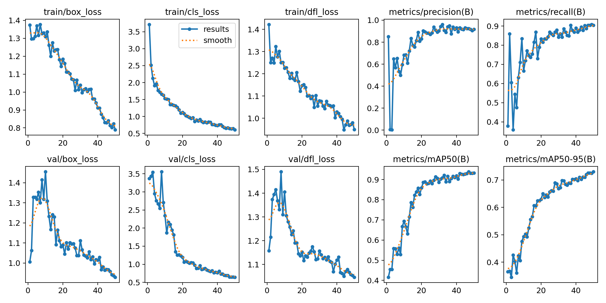

Wound Detection using YOLOv8
============================

 

Overview
--------

This project contains a YOLOv8-based model designed to detect wounds and a
reference image from input images. The reference image was intended for future
use-case in calculating the area of the detected wound.

 

Features
--------

-   **Wound Detection:** Accurately wound detection in images.

-   **Reference Detection:** Accurately reference image detection to assist in
    wound area calculations.

-   **Custom Dataset:** Trained on manually labeled custom dataset for precise
    detection.

-   **Easy Retraining:** Easy to retrain on similar dataset for even more
    precise wound detection.

 

Offline Installation
--------------------

To use the model for offline detection, follow these steps:

1.  Close the Repository

~~~~~~~~~~~~~~~~~~~~~~~~~~~~~~~~~~~~~~~~~~~~~~~~~~~~~~~~~~~~~~~~~~~~~~~~~~~ bash
git clone https://github.com/void-1409/wound_detection
cd wound_detection
~~~~~~~~~~~~~~~~~~~~~~~~~~~~~~~~~~~~~~~~~~~~~~~~~~~~~~~~~~~~~~~~~~~~~~~~~~~~~~~~

1.  Install virtualenv package and create a python virtual environment and
    activate it.

~~~~~~~~~~~~~~~~~~~~~~~~~~~~~~~~~~~~~~~~~~~~~~~~~~~~~~~~~~~~~~~~~~~~~~~~~~~ bash
pip install virtualenv
virtualenv venv
venv\Scripts\activate
~~~~~~~~~~~~~~~~~~~~~~~~~~~~~~~~~~~~~~~~~~~~~~~~~~~~~~~~~~~~~~~~~~~~~~~~~~~~~~~~

1.  Install Dependencies

~~~~~~~~~~~~~~~~~~~~~~~~~~~~~~~~~~~~~~~~~~~~~~~~~~~~~~~~~~~~~~~~~~~~~~~~~~~ bash
pip install -r requirements.txt
~~~~~~~~~~~~~~~~~~~~~~~~~~~~~~~~~~~~~~~~~~~~~~~~~~~~~~~~~~~~~~~~~~~~~~~~~~~~~~~~

1.  Run the detection

~~~~~~~~~~~~~~~~~~~~~~~~~~~~~~~~~~~~~~~~~~~~~~~~~~~~~~~~~~~~~~~~~~~~~~~~~~~ bash
yolo task=detect mode=predict model=best.pt conf=0.7 source="/test/images"
~~~~~~~~~~~~~~~~~~~~~~~~~~~~~~~~~~~~~~~~~~~~~~~~~~~~~~~~~~~~~~~~~~~~~~~~~~~~~~~~

Note: change the path of `source` in above line to your image dataset to test.

 

Dataset
-------

The custom dataset used for training this model consists of manually labeled
images, with two classes.

-   **Wound Class:** labelled as `wound`.

-   **Reference Class:** labelled as `reference`.

 

Results
-------

The results of final detection of trained models are stored in `runs/detect`
directory, with bounding box drawn around the detected wounds and reference
images.

 

Here is one example of prediction of an image from the test dataset:

 

Also, here are the results from training:

 

Retraining the Model
--------------------

In order to retrain the model, you can use pre-trained `best.pt` model as input
model and retrain it on your custom dataset. Further information for training
YOLOv8 model can be found on Ultralytics website
[here](https://docs.ultralytics.com/modes/train).

 

 
